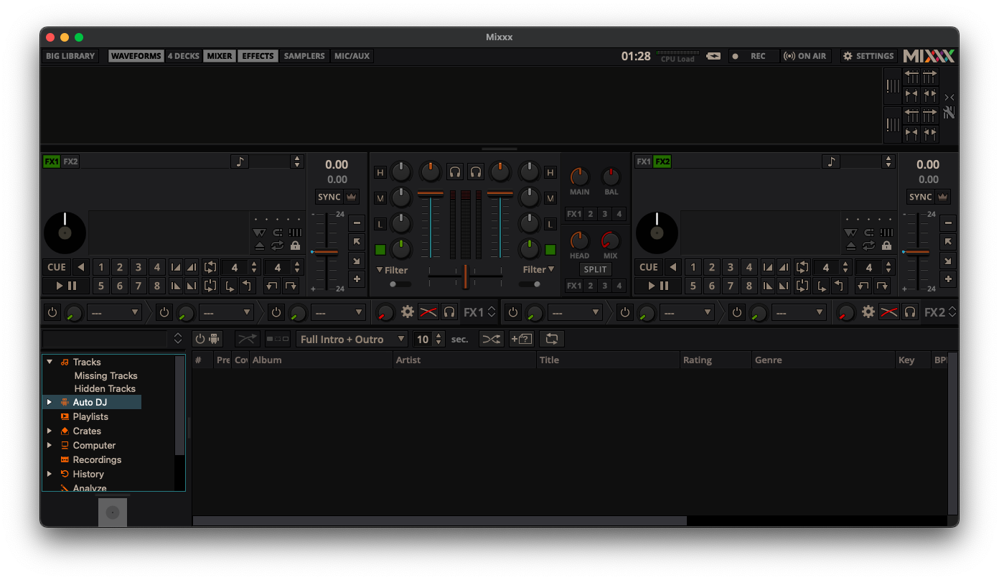

# M1xxx

[](https://github.com/fwcd/m1xxx/actions/workflows/build.yml)
<!-- [](https://github.com/fwcd/m1xxx/actions/workflows/automerge.yml) -->

Unofficial Apple Silicon (arm64 macOS) builds of the free and open source DJ software [Mixxx](https://mixxx.org/).



## Background

Mixxx currently only provides builds for x86-64 macOS. While these run fine under Rosetta 2, native Mixxx builds for arm64 run at roughly half the CPU load and feel noticeably more snappy than the x86-64 version.

Mixxx requires Qt 5.12 due to a breaking change in the OpenGL views that underpin waveform rendering, the first version of Qt that supports arm64 macOS, however, is 5.15. Therefore the linked `vcpkg` fork [backports the required patches](https://github.com/fwcd/vcpkg/tree/arm64-osx-mixxx/overlay/osx/qt5-base/patches) for supporting Qt 5.12 on arm64 macOS.

In short, this repo builds Mixxx's dependencies, including a patched version of Qt, and Mixxx itself by cross-compiling to arm64 macOS in GitHub Actions.

## Upstreaming process

Both the `mixxx` and the `vcpkg` branch now use the official upstream revisions.

## Building natively on Apple Silicon (arm64 macOS) hosts

While the CI workflows in this repo mainly deal with the case of cross-compiling Mixxx from x86_64 macOS runners to arm64, it is also possible to compile directly from an arm64 macOS (Apple Silicon) host.

First, make sure to have Homebrew installed and the submodules in this repo checked out (using `git submodule update`). To install the system dependencies, run:

```sh
scripts/install-brew-deps
```

To compile and install Mixxx's dependencies into `vcpkg` run:

```sh
scripts/bootstrap-vcpkg
scripts/install-vcpkg-deps
```

To build Mixxx, run:

```sh
export VCPKG_ROOT="$PWD/vcpkg"
export VCPKG_DEFAULT_TRIPLET=arm64-osx

cd mixxx
cmake -B build -G Ninja -DCMAKE_TOOLCHAIN_FILE="$VCPKG_ROOT/scripts/buildsystems/vcpkg.cmake"
cmake --build build
```

## Building for iOS (WIP)

> **Note:** These instructions are not fully tested yet and may still cause build failures.

To build for iOS, install the system dependencies as above, make sure the submodules are checked out and install the dependencies by running:

```sh
scripts/bootstrap-vcpkg
scripts/install-vcpkg-deps --skip-host-packages --target arm64-ios
```

To configure Mixxx, run:

```sh
export VCPKG_ROOT="$PWD/vcpkg"
export VCPKG_DEFAULT_TRIPLET=arm64-ios

# NOTE: This script should not be sourced before the vcpkg dependencies have
#       been installed, otherwise the Qt host tools will implicitly be
#       built with the iOS sysroot rather than the macOS sysroot and throw
#       linker errors.
source vars/ios-sdkroot.sh

cd mixxx
cmake -B build \
      -G Xcode \
      -DCMAKE_SYSROOT="$SDKROOT" \
      -DCMAKE_SYSTEM_NAME=iOS \
      -DCMAKE_TOOLCHAIN_FILE="$VCPKG_ROOT/scripts/buildsystems/vcpkg.cmake" \
      -DRUBBERBAND=OFF \
      -DQTKEYCHAIN=OFF
```

The Xcode project at `build/mixxx.xcodeproj` should then contain an iOS target for Mixxx.

## Credits

Thanks to [`daschuer`](https://github.com/daschuer) for the work involved in backporting the relevant Qt patches, parts of the CI workflows and assistance in building the dependencies!
